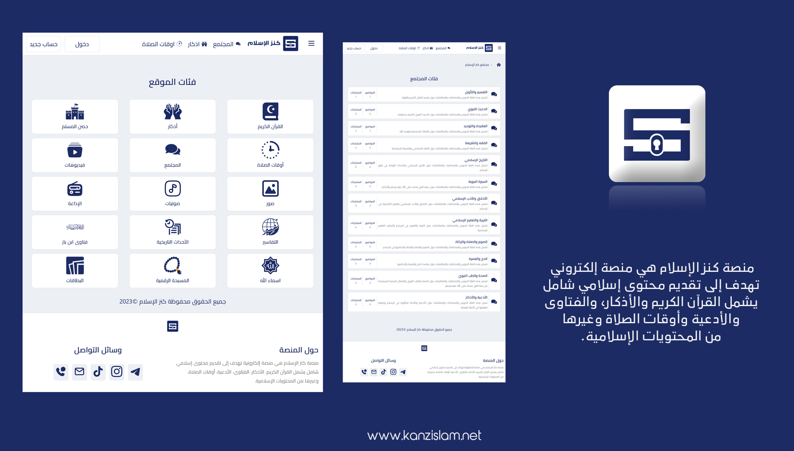

# Islamic_platform

<br>
<br>
<br>


<div align="center">

 <br><br>





</div>

<br>

# المتطلبات 
- git
- node & npm 
- docker *غير إلزامي*

<br>

**ملف التكوين .env**

```bash
PORT=3000
WEBSITE_NAME=كنز الإسلام
WEBSITE_DOMAIN=https://www.Kanzislam.net
SITEMAP_LIMIT=5000
CONTACT_EMAIL=KanzislamNet@gmail.com
CONTACT_TIKTOK=https://www.tiktok.com/@kanzislamnet
CONTACT_INSTAGRAM=https://www.instagram.com/kanzislamnet
CONTACT_TELEGRAM=https://t.me/KanzislamNet
CONTACT_PHONE=+966553556010
```

<br>

# طريقة التشغيل

- `git clone https://github.com/kanzislam/Kanzislam` 
- `cd Kanzislam `
- `nano .env.example`
- `mv .env.example .env`
- طريقة تشغيل عن طريق Docker

```bash
#build
docker build -t kanzislam:2.0 .
#run 
docker run -p 8080:3000 kanzislam:2.0
# يمكن الوصول للموقع عبر http://localhost:8080
```

**او**

- `npm install`
- `npm start`

- لتشغيل في وضع التطوير 
- `npm run dev`
- لإنشاء خريطة للموقع sitemap.xml
- `npm run sitemap`


# الرخصة 
هذا المشروع مرخص بموجب ترخيص [GPL-3](https://github.com/kanzislam/Kanzislam/blob/main/LICENSE) - راجع ملف الترخيص للحصول على التفاصيل.

# Support
For any issues or feature requests, please open an issue.
