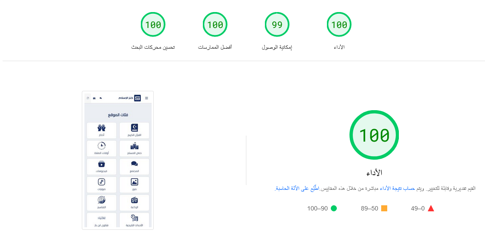

# Islamic_platform


<div align="center">

**المشروع لم يكتمل بعد** ⏳

</div>

<br>
<br>
<br>


<div align="center">

 <br><br>




</div>


<div align="center">

**ملف التكوين**

</div>

```json
{
    "WEBSITE_NAME": "كنز الإسلام",
    "WEBSITE_DOMAIN": "http://localhost:3000",
    "PORT": 3000,
    "SESSION_SECRET": "SESSION_SECRET",
    "SMTP_HOST": "smtp.example.com",
    "SMTP_PORT": 587,
    "SMTP_DISPLAY_NAME": "كنز الإسلام | Kanzislam",
    "SMTP_USER": "support@example.net",
    "SMTP_PASS": "SMTP_PASS",
    "CHROMIUM_PATH": "C:\\Program Files\\Google\\Chrome\\Application\\chrome.exe",
    "FORUM": {
        "TITLE_LENGTH": 80,
        "CONTENT_LENGTH": 10000,
        "MAX_IMAGES": 10
    }
}
```